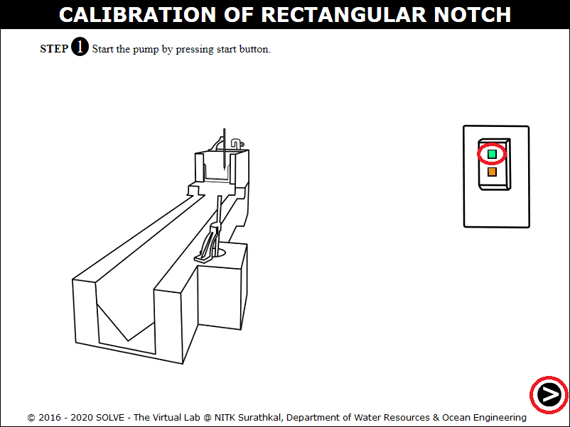
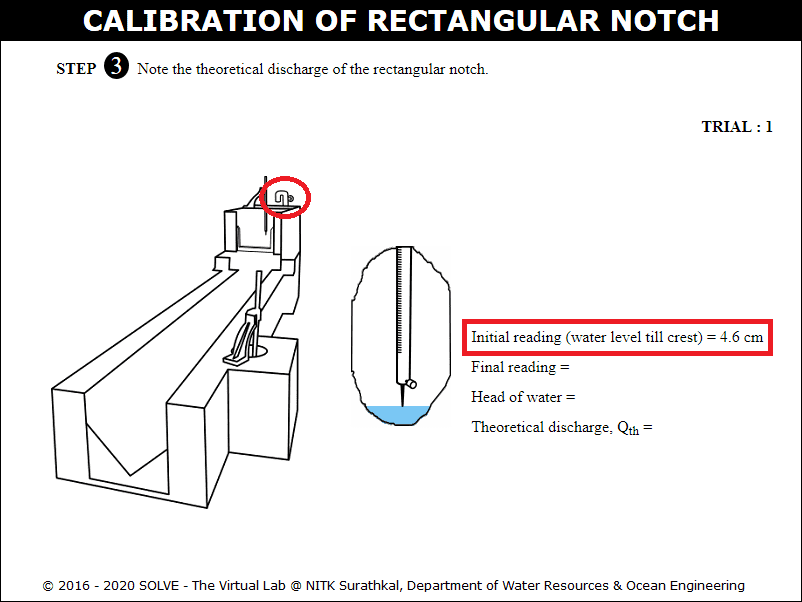

#### These procedure steps will be followed on the simulator

<ol>
<li>Open the Calibration of Rectangular notch experiment and click on the next button shown at the bottom right corner.</li>

<li>Start the pump by clicking on green button and then click on the next button.</li>

<li>Click on the inlet valve to rotate it.</li>

<li>Click on hand to rotate the inlet valve and click on the next button.</li>

<li>Note the initial reading of the hook gauge and click on the hook gauge.</li>

<li>Calculate head of water, theoretical discharge of rectangular notch and click the next button.</li>

<li>Note the initial reading of the hook gauge and click on the hook gauge.</li>

<li>Calculate head of water, actual discharge of V-notch and click the next button.</li>

<li>Calculate coefficient of discharge for rectangular notch.</li>

<li>Repeat the same procedure, after certain trials, click on the red button to stop the pump.</li>

</ol>
