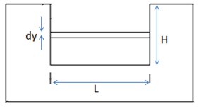
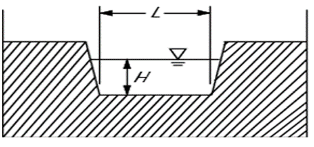
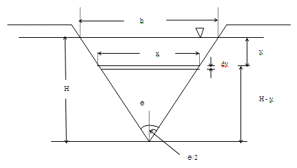
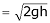
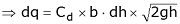
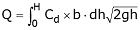
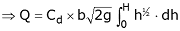

### INTRODUCTION 

A Notch is a device used for measuring the rate of flow of a liquid through a small channel or a tank. It may be defined as an opening in the side of a tank or vessel such as liquid surface in the tank is below the level of opening.

Notches can be of different shapes such as triangular, rectangular, trapezoidal, stepped notch, etc. the bottom of the notch over which the water flows is known as crest or sill and the thin sheet of water flowing through the notch is known as nappe or vein. The edges of the notch are bevelled on the downstream side so as to have a sharp-edged sides and crest resulting in minimum contact with the flowing fluid.

</img>

The discharge over notch is measured by measuring the head acting over the notch. As water approaches the notch, its surface becomes curved. Therefore, the head over the notch is to be measured at the upstream of the notch where the effect of curvature is minimum. Also, it should be close to the notch so that the loss of energy between head measuring section and notch is negligible. In practical, the head over notch is measured at a distance of 3 to 4 times the maximum head from the notch.

### Classifications of notch:
#### Rectangular notch:

It takes its name from the shape of its notch. The discharge through a weir or notch is directly related to
the water depth or head (H). This head is affected by the condition of the crest, the contraction, the velocity of approaching stream and
the elevation of the water surface downstream from the weir.

</img>

#### Trapezoidal or Cipolletti notch:

The Cipolletti notch is trapezoidal in shape. The slope of the sides, inclined outwardly from the crest and should be one horizontal to four vertical.

</img>

#### V-Notch

In this case, the notch is "V" in shape. Depth of water above the bottom of the V is called head (H).
The V-notch design causes small changes in discharge hence causing a large change in depth and thus allowing more accurate measurement
than with a rectangular notch.

</img>

#### Stepped notch:

A stepped notch is a combination of rectangular notches as shown in figure. It is thus obvious that the discharge over such a notch will be the sum of the discharges over the different rectangular notches.

</img>

Let us consider a horizontal strip of water of thickness dh at a depth of h from the water level as shown in figure.

</img>

Let,

H = Height of water above sill of notch

b = Width or length of the notch

Cd = Coefficient of discharge

	</img>
	 &nbsp;&nbsp;&nbsp;-------(1)

 

We know that,

	 The theoretical velocity of water through the strip
	</img>
	 &nbsp;&nbsp;&nbsp;-------(2)

 

Discharge through the strip,

</img> 
</img> 

The total discharge over the whole notch may be found out by integrating the above equation within the limits 0 and H.

</img> 
</img> 
</img> 

### Ventilation of notch or weirs:

The nappe emerging out from the notch or weir touches the side walls of the channel. The air below the nappe and the walls are trapped. This air gradually carried along with flowing water and the pressure between the nappe and wall is reduced below atmospheric pressure. Eventually negative pressure is developed and as a result, the nappe starts to depress. The nappe is coming near the wall of the weir and such type of nappe is called depressed nappe.

</img> 

When water emerges out, the initial nappe becomes depressed nappe where pressure falls below in this area. The discharge increases due to low pressure in the downstream. When no air is left in the space, the nappe adheres to the weir or notch and the nappe is called clinging nappe. During this clinging of nappe, the ventilated holes are made on the wall and the weir. These holes are known as ventilation holes and the notch is known as notch.

The experimental data shows that the ventilated area may be about 0.5% of (L x Z), where L is the length of crest and Z is the depth of water.

### Effect of computed discharge due to measurement of head:

The equation of discharge in rectangular notch is 

</img> 
</img> 
</img>  

Let dQ and dH be the errors in measurement of discharge and head.

</img> 
</img>  

i.e., an error of 1% in the discharge is equal to 1.5% of error in the head of rectangular channel.

